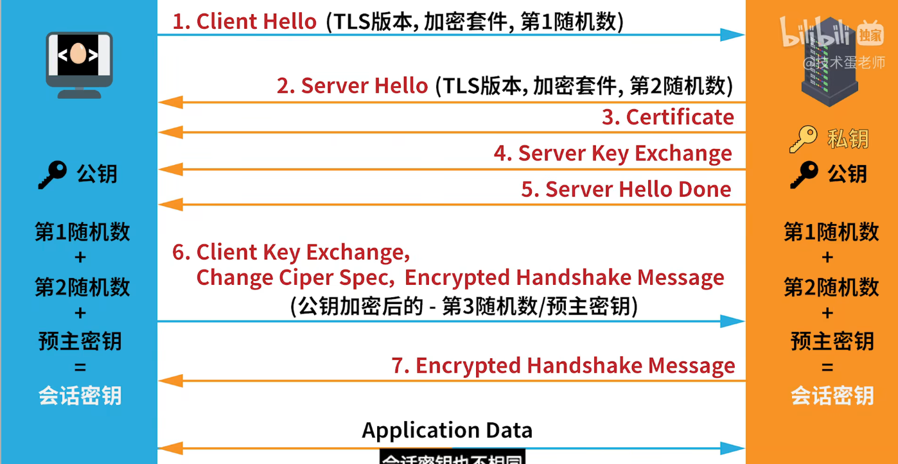

title: https加密原理

### 1. **SSL/TLS 握手过程概述**

在 **SSL/TLS 握手** 中，客户端和服务器进行一系列的交互，以确保加密通信的安全性。握手过程分为多个步骤，其中包括非对称加密（公钥加密）和对称加密（会话密钥）。这个过程并不会在 TCP 三次握手中完成，而是在 TCP 连接建立后执行，紧接着进行。

### 2. **客户端和服务器的通信过程**

根据图片的步骤，整个 **SSL/TLS 握手** 过程可以分为以下几个主要阶段：

#### **步骤 1：Client Hello（客户端问候）**

- 客户端向服务器发送 `Client Hello` 消息，其中包括：
    - 支持的 TLS 版本（如 TLS 1.2 或 TLS 1.3）。
    - 支持的加密套件（如 RSA、ECDSA）。
    - 随机数（`client_random`），用于后续生成会话密钥。
      

#### **步骤 2：Server Hello（服务器问候）**

- 服务器响应客户端的 `Client Hello`，并发送 `Server Hello` 消息，其中包括：
  
    - 服务器选择的加密套件。
      
    - 服务器选择的 TLS 版本。
      
    - 随机数（`server_random`），用于后续生成会话密钥。
      

#### **步骤 3：服务器证书（Server Certificate）**

- 服务器发送 **SSL/TLS 证书**，该证书由可信的 **证书颁发机构（CA）** 签发，证书包含服务器的公钥和服务器的身份信息（如域名）。
  
- 客户端验证证书的有效性，确保证书是由受信任的 CA 签发，且证书有效（未过期）。
  

#### **步骤 4：服务器密钥交换（Server Key Exchange）**

- 如果使用 **非对称加密**，服务器会发送公钥（如果使用 **RSA**，则客户端直接使用公钥加密会话密钥）。
  
- 在某些加密套件（如 **ECDHE**）中，服务器会发送额外的密钥交换信息，以便客户端生成共享密钥。
  

#### **步骤 5：服务器完成问候（Server Hello Done）**

- 服务器发送 `Server Hello Done` 消息，表示服务器已完成初始化过程，等待客户端的进一步响应。
  

#### **步骤 6：客户端密钥交换（Client Key Exchange）**

- 客户端生成一个 **Pre-master Secret**，并使用服务器的公钥加密该密钥。然后，客户端将加密的 Pre-master Secret 发送给服务器。
  
    - 如果使用 **RSA** 加密方式，客户端直接使用服务器的公钥加密 Pre-master Secret。
      
    - 如果使用 **DH** 或 **ECDHE** 等协议，客户端会计算出一个共享的密钥。
      

#### **步骤 7：更改密码规范（Change Cipher Spec）**

- 客户端和服务器在握手过程中交换一个 **Change Cipher Spec** 消息，表明接下来的通信将使用经过握手协商的加密和认证算法。
  
    - 这一步标志着非对称加密阶段结束，双方将开始使用 **对称加密**（会话密钥）进行数据传输。
      

#### **步骤 8：加密握手消息（Encrypted Handshake Message）**

- 客户端和服务器交换加密的握手消息，确保这一步的所有信息在传输过程中没有被篡改。
  

#### **步骤 9：会话完成，开始安全通信**

- 一旦双方完成了上述步骤，安全的对称加密会话密钥就会建立起来。
  
- 之后的通信将通过对称加密进行保护，从而提高性能并减少计算开销。
  

### 3. **非对称加密与对称加密的结合**

- 在 **SSL/TLS 握手** 中，使用了 **非对称加密** 和 **对称加密** 的结合：
  
    - **非对称加密**：在握手过程中使用公钥加密和私钥解密，用来交换 **Pre-master Secret**，并确保初始的安全通道。
      
    - **对称加密**：一旦会话密钥（对称密钥）生成，之后的所有通信都会使用对称加密进行处理，因为对称加密的效率更高。
      

### 4. **证书与 CA 证书链的关系**

- **服务器证书** 是由 **CA（证书颁发机构）** 颁发的，CA 是受信任的第三方，负责验证服务器的身份。
  
- 客户端通过 **证书链** 来验证服务器证书的有效性：
  
    1. **根证书（Root Certificate）**：浏览器或操作系统已经预装了根证书，这些证书被广泛信任。
       
    2. **中间证书（Intermediate Certificate）**：根证书签发中间证书，中间证书进一步签发服务器证书。客户端通过根证书和中间证书建立信任。
       
    3. **验证过程**：浏览器会验证整个证书链，从根证书到中间证书，再到服务器证书，确保证书链的完整性和有效性。
       

### 5. **SSL/TLS 握手与 TCP 三次握手的关系**

- **SSL/TLS 握手** 与 **TCP 三次握手** 是两个不同的过程：
  
    - **TCP 三次握手** 主要用于建立一个可靠的连接。
      
    - **SSL/TLS 握手** 则是在 TCP 连接建立后，用于协商加密算法、交换证书、生成会话密钥等安全措施。
    
- **SSL/TLS 握手** 依赖于 **TCP 连接**，但是它不是 TCP 三次握手的一部分，而是一个在建立连接后的后续过程。
  

### 6. **总结**

- **SSL/TLS 握手过程** 使用 **非对称加密** 交换 **Pre-master Secret**，并在会话建立后使用 **对称加密** 进行高效的加密通信。
  
- 证书的可信性依赖于 **证书链**，并通过 **CA（证书颁发机构）** 验证。根证书是浏览器信任的基础，确保服务器身份的真实性。
  
- 握手过程中包括了多个重要步骤，从客户端和服务器交换消息、生成共享密钥到加密通信的开始。
  

这些步骤保证了 HTTPS 连接的 **机密性**、**完整性** 和 **身份验证**，确保客户端与服务器之间的安全通信。