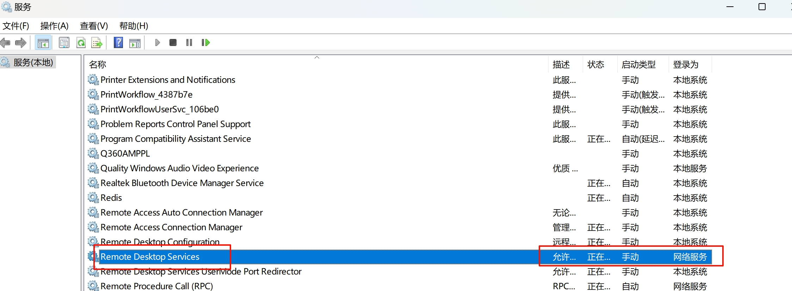

 

> \[!warning\] 提示  
> 远程桌面貌似只支持专业版，不支持家庭版，请自行在`设置`\>`系统`\>`系统信息`检查

1.检查远程设置是否开启
------------

打开`设置`\>`系统`\>`远程桌面`，把远程桌面开关打开  


打开`设置`\>`系统`\>`系统信息`\>`高级系统设置`，点击远程，把`允许远程连接到计算机`选中，对于`仅允许运行使用网络级别身份验证的远程桌面的计算机连接(建议)(N)`，可勾可不勾  


2.检查防火墙、服务、组策略
--------------

**防火墙：** 打开`控制面板`\>`系统和安全`\>`Windows Defender 防火墙`，选择`允许应用通过WindowsDefender防火墙进行通信`  
往下滑，找到远程桌面，然后勾选专用，或者可以都勾选上（按理说应该只有一个，我这里不知道为什么有两个就都勾选了）  


**服务：** 任务栏搜索框搜索`服务`打开应用，找到，没启动的话启动一下  


**组策略：** 任务栏搜索框搜索`编辑组策略`，选择计算机配置>Windows设置>安全设置>本地策略>安全选项，找到`网络访问：本地帐户的共享和安全模型`，把它改为经典；找到`帐户：使用空密码的本地帐户只允许进行控制台登录`，把它禁用  


3.正确登录方式
--------

把以上设置后，应该能正常连接，现在的问题是账户连接问题

### 3.1通过微软账户登录

针对电脑是使用用微软账户登录，而不是本地账户登录的电脑（不知道可`设置`\>`账户信息`查看）  


微软账号登录正常应该是输入邮箱作为账号，密码就微软账户密码即可，发现无法登录成功，是因为近段时间没有使用微软账户密码进行登录，如果你没有发现电脑锁定后有通过微软账户密码进行登录的选项，请把`设置`\>`账户`\>`登录选项`，把`为了提高安全性，在此设备上仅允许使用WindowsHello登录Microsoft 帐户（推荐）`即可  
  
或者可以输入下方命令刷新密码，不过这个我未做尝试， `xxxx@qq.com`是你的用户名

```
runas /u:MicrosoftAccount\xxxx@qq.com winver
```

此时我们锁定电脑，应该会有通过微软密码登录的选项，输入密码重新登录一下  


此时尝试进行远程连接，应该是没问题了

### 3.2通过本地账户登录

由于我使用的是微软账户登录，所以没试过，应该可以直接使用本地用户名和密码登录（注意不是pin码，记不住可以在`设置>登录选项>密码`更改），不行的话接着看下面方法。

> 注意：因为使用新创建的用户，可能部分数据或应用无法找到，因为不是原来的用户，应用的话安装时选择了只安装到当前用户，如要确保数据完整，最好还是**当前微软账户或本地账户登录**

此方法，对于使用微软账户登录的电脑同样适用！！  
任务栏搜索框搜索`计算机管理`，打开，选择系统`工具>本地用户和组>用户`  


用户名密码自己定义，记得把`用户下次登录时须更改密码(M)`取消勾选，把`密码永不过期打开`  


回到`设置`\>`系统`\>`远程桌面`，选择远程桌面用户，点击添加，输入刚刚创建好的用户名，点击检查名称，选择我们需要的用户进行添加，然后确定（也可以在第一步，第二张图片点击`选择用户`进入，是一样的）  


此时，远程桌面用户应该已经有了我们的用户  


此时应该可以正常进行远程连接了

4.其它
----

电脑连接远程的话，打开桌面远程连接即可；手机或平板可选择使用Windows app来链接，苹果应用商店和Google Play都有


首发来自我的 CSDN https://blog.csdn.net/weixin_45564332/article/details/149141381?spm=1001.2014.3001.5501