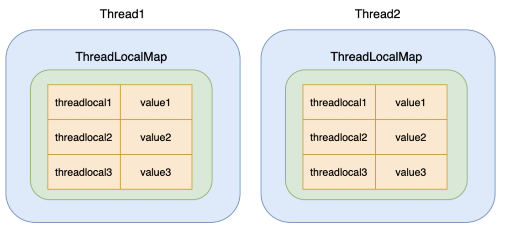
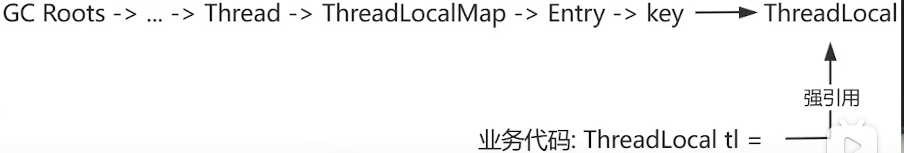
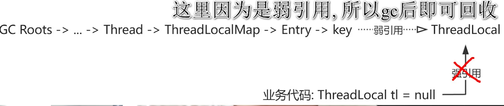
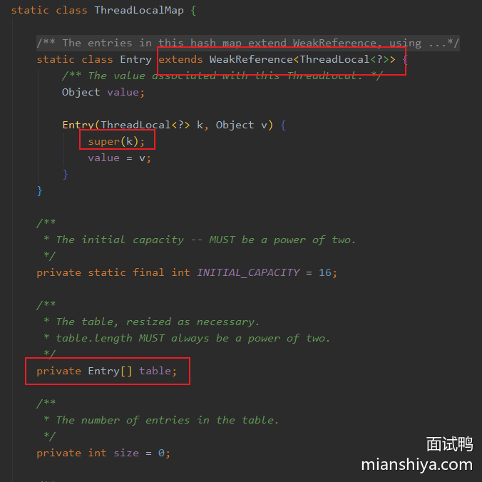
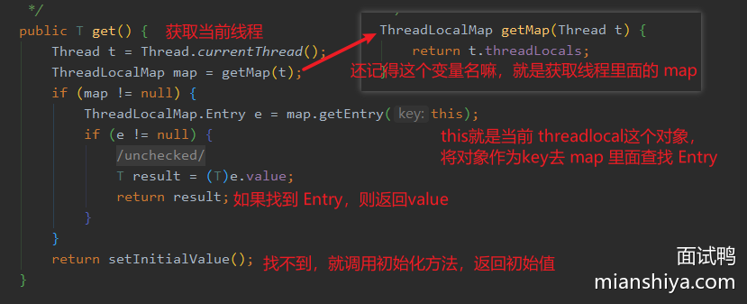
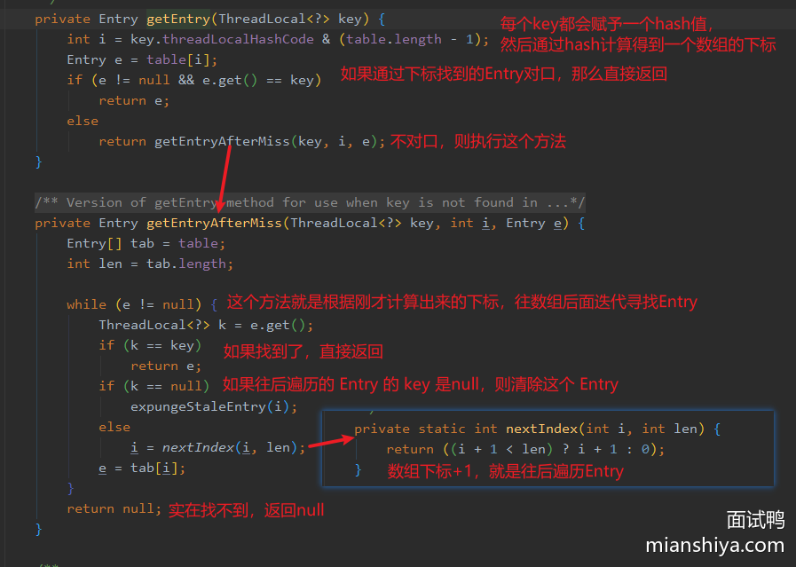
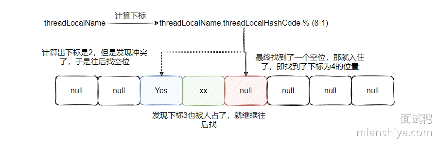
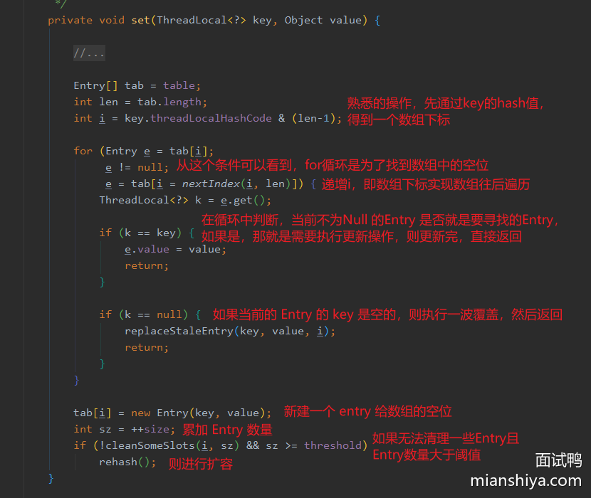
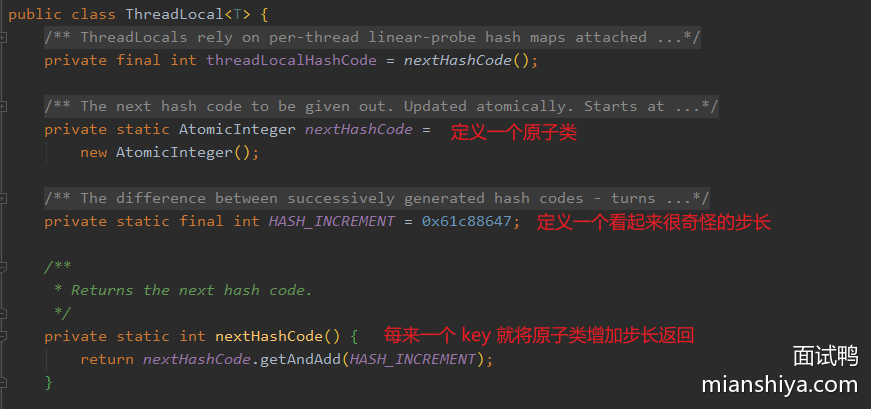

# ThreadLocal结构

`ThreadLocal` 的设计在 Java 中是为了实现线程隔离，让每个线程拥有自己的私有变量副本，避免多个线程访问共享数据时的竞争和同步问题。它背后的核心思想是 **线程本地存储**，即每个线程都可以独立存储自己的数据，线程之间不会互相干扰。
### 1. **核心：**
`ThreadLocal` 的作用是为每个线程提供一个独立的变量副本。不同的线程通过 `ThreadLocal.get()` 和 `ThreadLocal.set()` 方法访问和设置属于自己的变量副本，而不会互相干扰。

### 2. **基本设计：**
需要在每个线程的本地都存一份值，说白了就是每个线程需要有个变量，来存储这些需要本地化资源的值，并且值有可能有多个。在线程对象内部搞个map，把 ThreadLocal 对象自身作为key，把它的值作为 map 的值。这样每个线程可以利用同一个对象作为key，去各自的map中找到对应的值。

比如现在有 3 个 ThreadLocal 对象，2 个线程。
```java
ThreadLocal<String> threadLocal1 =  new ThreadLocal<>();
ThreadLocal<Integer> threadLocal2 =  new ThreadLocal<>();
ThreadLocal<Integer> threadLocal3 =  new ThreadLocal<>();
```
ThreadLocal和线程的关系如下：


源码：
在Thread类中，定义了变量
```java
/* 与此线程相关的ThreadLocal值。此映射由ThreadLocal类维护。 */
ThreadLocal.ThreadLocalMap threadLocals = null;
```


#### 为什么会出现内存泄漏？
如果说我们正常去new thread用完之后正常销毁,那thread类中的thread local map这个属性也就会被GC回收了,不会出现内存泄漏问题,但是项目中都是直接使用线程池,spring boot项目处理请求的时候,也是从线程池中拿出来一个线程,然后去处理请求的线程池中的线程也不会销毁,会一直复用，会一直存在一条引用链

#### 为什么key要设置为弱引用
避免内存泄漏问题。假设你有一个 `ThreadLocal` 对象，它与线程之间建立了强引用关系。如果 `key` 是强引用，当线程结束后，它和 `key` 会继续保持引用关系，导致 `ThreadLocal` 以及 `ThreadLocal` 存储的值（`value`）不能被 GC 回收。

弱引用的引入，确保 `key` 对象在没有其他强引用指向它时会被 GC 清理掉，这样就避免了内存泄漏。


`ThreadLocal` 中的 **`key`** 使用了 **弱引用**，但这并不意味着 **在垃圾回收（GC）之后，`key` 一定会被回收**。
在 `ThreadLocal` 中，`key` 是 `ThreadLocal` 对象，它是弱引用的。这是为了确保当`ThreadLocal` 对象没有强引用时，可以及时被回收，避免因长时间存在于 `ThreadLocalMap` 中而造成内存泄漏。只有把threadlocal（key)对象设置为null,没有其它的对象引用，只剩下entry对key的弱引用，GC才能自动回收。

key虽然为null了，但是`ThreadLocalMap` 中的 `value`（存储线程本地变量的数据）仍然存在，没有被清除。因为value仍然被Entity引用。为了避免这种情况，JDK 的 `ThreadLocalMap` 设计中，每当线程调用 `ThreadLocal` 的 `get()`、`set()` 或 `remove()`（为什么我们要手动remove，因为这种自动清理是惰性的，不完全的） 方法时，它都会遍历 `ThreadLocalMap` 中的所有条目，**清理掉 `key` 为 `null` 的无效条目**。


#### **为什么 `value` 不是弱引用？**  
`value` 需要保持强引用，因为在你调用 `ThreadLocal` 的 `get` 方法时，通常是希望能获取到当前线程中对应的 `value`。如果 `value` 是弱引用，一旦没有强引用指向它，它可能会被 GC 回收，导致我们无法获得正确的 `value`。因此，`value` 需要是强引用，以保证线程在有效期内能继续访问它。

#### **为什么会有内存泄漏，怎么避免？**  
内存泄漏的主要原因是当我们使用 `ThreadLocal` 时，线程池中的线程会一直存活，线程本身会复用，而 `ThreadLocal` 中的 `key` 可能没有及时清理，导致内存无法释放。为了避免内存泄漏，开发者需要手动调用 `ThreadLocal.remove()` 方法，确保当不再需要 `ThreadLocal` 存储的 `value` 时，它可以被清除，避免形成不必要的强引用链


### 从源码层面分析 Java 的 ThreadLocal 原理  （下方转载自面试鸭）

上面我们说到 Thread 对象里面会有个 ThreadLocalMap，用来保存本地变量。  

我们来看下 jdk 的 Thread 实现：  

```java  
public class Thread implements Runnable {  
// 这就是我们说的那个 map 。  
ThreadLocal.ThreadLocalMap threadLocals = null;  
}  
```
可以看到，确实有个 map ，不过这个 map 是 ThreadLocal 的静态内部类，记住这个变量的名字 threadLocals，下面会有用的哈。  

看到这里，想必有很多小伙伴会产生一个疑问。  

> 竟然这个 map 是放在 Thread 里面使用，那为什么要定义成 ThreadLocal 的静态内部类呢？  

首先内部类这个东西是编译层面的概念，就像语法糖一样，经过编译器之后其实内部类会提升为外部顶级类，和平日里外部定义的类没有区别，也就是说在 JVM 中是没有内部类这个概念的。  

一般情况下非静态内部类用在内部类，跟其他类无任何关联，专属于这个外部类使用，并且也便于调用外部类的成员变量和方法，比较方便。  

而静态外部类其实就等于一个顶级类，可以独立于外部类使用，所以更多的只是表明类结构和命名空间。  

所以说这样定义的用意就是说明 ThreadLocalMap 是和 ThreadLocal 强相关的，专用于保存线程本地变量。  

现在我们来看一下 ThreadLocalMap 的定义：  

  

重点我已经标出来了，首先可以看到这个 ThreadLocalMap 里面有个 Entry 数组，熟悉 HashMap 的小伙伴可能有点感觉了。  

这个 Entry 继承了 WeakReference 即弱引用。这里需要注意，不是说 Entry 自己是弱引用，看到我标注的 Entry 构造函数的 super(k) 没，这个 key 才是弱引用。  

所以 ThreadLocalMap 里有个 Entry 的数组，这个 Entry 的 key 就是 ThreadLocal 对象，value 就是我们需要保存的值。  

> 那是如何通过 key 在数组中找到 Entry 然后得到 value 的呢 ？  

来看下 ThreadLocal 的get 方法，这里就可以得知为什么不同的线程对同一个 ThreadLocal 对象调用 get 方法竟然能得到不同的值了。  

  

这个中文注释想必很清晰了吧！`ThreadLocal#get `方法首先获取当前线程，然后得到当前线程的 ThreadLocalMap 变量即 threadLocals，然后将自己作为 key 从 ThreadLocalMap 中找到 Entry ，最终返回 Entry 里面的 value 值。  

这里我们再看一下 key 是如何从 ThreadLocalMap 中找到 Entry 的，即`map.getEntry(this)`是如何实现的，其实很简单。  


  


可以看到 ThreadLocalMap 虽然和 HashMap 一样，都是基于数组实现的，但是它们对于 Hash 冲突的解决方法不一样，HashMap 是通过链表(红黑树)法来解决冲突，而 ThreadLocalMap 是通过开放寻址法来解决冲突。  

听起来好像很高级，其实道理很简单，我们来看一张图就很清晰了。  


  

所以说，如果通过 key 的哈希值得到的下标无法直接命中，则会将下标 +1，即继续往后遍历数组查找 Entry ，直到找到或者返回 null。  

可以看到，这种 hash 冲突的解决效率其实不高，但是一般 ThreadLocal 也不会太多，所以用这种简单的办法解决即可。  

至于代码中的 `expungeStaleEntry` 我们等下再分析，先来看下 `ThreadLocalMap#set` 方法，看看写入的怎样实现的，来看看 hash 冲突的解决方法是否和上面说的一致。  


  

可以看到 set 的逻辑也很清晰，先通过 key 的 hash 值计算出一个数组下标，然后看看这个下标是否被占用了，如果被占了看看是否就是要找的 Entry ，如果是则进行更新，如果不是则下标++，即往后遍历数组，查找下一个位置，找到空位就 new 个 Entry 然后把坑给占用了。  

当然，这种数组操作一般免不了阈值的判断，如果超过阈值则需要进行扩容。  

上面的清理操作和 key 为空的情况，下面再做分析，这里先略过。  

至此，我们已经分析了 ThreadLocalMap 的**核心操作 get 和 set** ，想必你对 ThreadLocalMap 的原理已经从源码层面清晰了！  

可能有些小伙伴对 key 的哈希值的来源有点疑惑，所以我再来补充一下 `key.threadLocalHashCode`的分析。  


  

可以看到 `key.threadLocalHashCode` 其实就是调用 `nextHashCode` 进行一个原子类的累加。  

注意看上面都是静态变量和静态方法，所以在 ThreadLocal 对象之间是共享的，然后通过固定累加一个奇怪的数字`0x61c88647`来分配 hash 值。  

这个数字当然不是乱写的，是实验证明的一个值，即通过 0x61c88647 累加生成的值与 2 的幂取模的结果，可以较为均匀地分布在 2 的幂长度的数组中，这样可以减少 hash 冲突。


参考：https://www.mianshiya.com/question/1780933295064772609
【面试官内心os：坏了，这小子是真懂ThreadLocal】 https://www.bilibili.com/video/BV13y7hzvEKa/?share_source=copy_web&vd_source=2742e5dda987a0c5a7869bfc88246163
